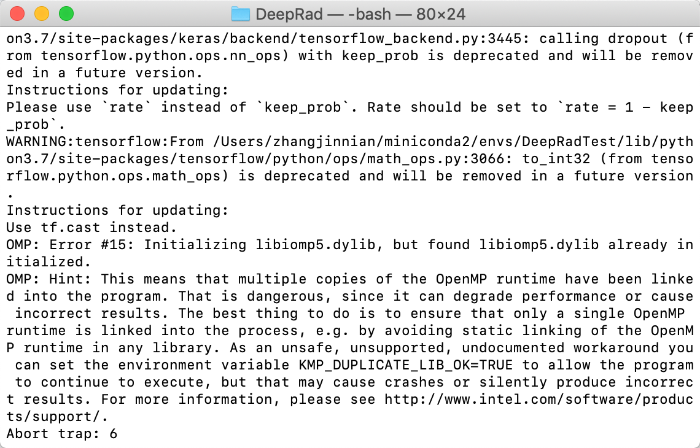

# DeepRad

This project is for the development of software related to medical imaging using deep learning. DeepRad has two different modes (quick use and developer mode), which are for different goals and researchers with different level of programming.

## 0. Requirements
Choose a method from (a) or (b) to install the dependent packages.
### a. Create a new 'conda' virtual environment **(recommendation)**
'''
conda create --name DeepRad --file requirements.yml
'''
### b. Install dependeny one by one
'''
conda install -c anaconda tensorflow-gpu (for GPU user)
conda install -c anaconda tensorflow (for CPU user)
conda install -c anaconda keras-gpu 
conda install -c conda-forge pyqt 
conda install -c conda-forge pillow 
conda install -c conda-forge opencv 
conda install -c conda-forge nibabel
conda install -c conda-forge qimage2ndarray
conda install -c simpleitk simpleitk
conda install -c conda-forge nilearn
conda install -c conda-forge pytables
conda install -c anaconda nomkl 
'''
#**Directly use conda**
#tensorflow
#keras
#tensorflow-gpu
#pyqt
#opencv
#pillow
#**Should refer to Anaconda Cloud** https://anaconda.org/anaconda/repo
#nibabel
#qimage2ndarray
#simpleitk
#nilearn
#**pip**
#tables


## 1. Quick Use

In **Quick Use** mode, there are 4 main functions: classification, segmentation, regression, and synthesis. In this mode, it only supports specific types of data, deep learning models, training and evaluation methods. A data management tool is also embedded in DeepRad to preprocess raw data so that they can be directly used in this mode. 

### 1.0 Data Management Tool

Currently, it only supports certain types of data storage.

1. Classification:
   - Data: single input channel or multiple input channels in 

2. Segmentation:

### 1.1 Classification

Framework: data(nii, hdf5, npy)/label (csv, hdf5, npy; binary or index), model (keras model zoo), training methods (only listed in keras).

### 1.2 Segmentation

Framework: data(nii, hdf5, npy; preprocessed)/truth(nii, hdf5, npy; index), model(Unet2D, Unet3D), training methods(only listed in keras)

#### Configuration Class

```python
self.config={
  # Prepare Data
  'data_folder': "",
  'modality_t1': True,
  'modality_t1ce': True,
  'modality_flair': True,
  'modality_t2': True,
  'label_folder': "", # will be removed
  'is_split': True,
  'is_validation_folder': False,
  'is_validation_index': False,
  'validation_ratio': 0.2,
  'validation_folder': "",
  'validation_index': "",
  'is_resize': True,
  'resize_row': 256,
  'resize_col': 256,
  'resize_channel': 256,
  
  # Choose Models
  'model': "",
  'input_size_row': 256,
  'input_size_col': 256,
  'input_size_channel': 3,
  'num_class': 2,
  
  # Data Augmentation
  'isDataAug': False,
  'data_aug_config': {},
  
  # Training Configuration
  'LossConfig': {},
  'OptimizerConfig': {},
  'learning_rate': 1e-4,
  'drop_factor': "",
  'patience': "",
  'batch_size_training': 32,
  'batch_size_validation': "",
  'epoch': 10,
  'early_stop': "",
  
  # Output Configuration
  'output_folder': "",
  'is_file_only': True,
  'isWeight': False,
  'isTensorboard': False,
  'isLogs': False
}
```


### 1.3


## 2. Developer Mode

In **Developer Mode**, it provides a framework for training and evaluation. Users can replace some of the modules by using their own codes. It will be more flexible and require users have a coding background.

## Q&A



Solutions:

1. Add the following codes in `main.py`

```python
import os
os.environ['KMP_DUPLICATE_LIB_OK']='True'
```

2. Install the following packages

```
conda install nomkl
```

